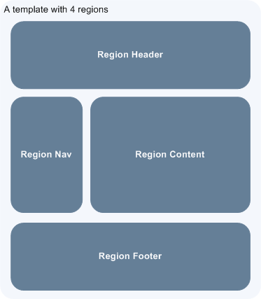
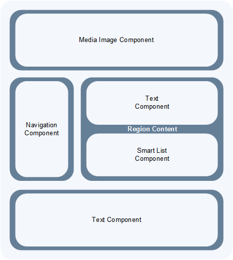
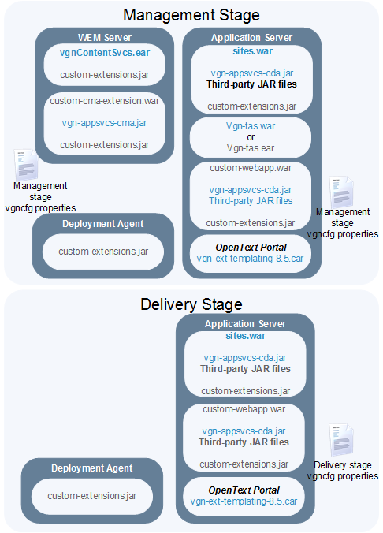

= Viglet Shiohara CMS: Guia do Desenvolvedor
Viglet Team <opensource@viglet.com>
:toc: left
:toc-title: Tabela de Conteúdo
:doctype: book
:revnumber: 0.3.6 
:revdate: 25-11-2019

[preface]
= Prefácio

The basis for this documentation germinated when I awoke one morning and was confronted by the dark and stormy eyes of the chinchilla.
She had conquered the mountain of government reports that, over the course of six months, had eroded into several minor foothills and a creeping alluvial plain of loose papers.

== Sobre o Autor

Você pode contactar Alexandre Oliveira em alexandre.oliveira@viglet.com.

Alexandre Oliveira adora desenvolvimento de aplicações corporativas.

[dedication]
= Dedicatória

Este livro é dedicado ao Enrico Shiohara, que ensinou tudo que sei sobre CMS.

= Capítulo 1. Introdução
[partintro]
--
Neste capítulo provém conceitos e outras informações requeridas para realizar tarefas de desenvolvimento do Shiohara CMS

Incluem os seguintes tópicos:

* <<1.1. Sobre o Shiohara CMS>>
* <<1.2. O que será coberto neste livro>>
* <<1.3. Documentações necessárias>>
--

== 1.1. Sobre o Shiohara CMS

O Viglet Shiohara CMS permite administradores e contribuidores usarem uma interface gráfica para definir como o conteúdo é apresentado nos web sites. A área de **Temas** é onde são gerenciados os objetos de apresentação. O **View Page** mostra a página completamente renderizada.

Existem 2 tipos de visualização do site: **Management** e **Publicado**, onde:

* **Management**: Contém todos os conteúdos do site, tanto publicados quanto despublicados e rascunhos
* **Publicado**: Site que exibe apenas conteúdos publicados. É necessário publicar os conteúdos para que sejam exibidos.

O Shiohara CMS tem Page Layouts e Regions de exemplo, que podem ser vistos quando é criado o site, e pode servir de ponto de partida para criar seu site. Além disto possui formas de desenvolver e personalizar de forma programática estes templates, em que iremos discutir neste documento.

== 1.1.1 Page Layouts e Regions

Um Page Layout é um bloco básico de construção para criar e gerenciar paginas usando padões repetidos. Cada página gerada é associada com exatamente um Page Layout, que controla o layout, tema e regiões na página.

O objetivo básico da apresentação é exibir pastas e conteúdos do repositório do Shiohara CMS como páginas web. Neste ponto é preciso associar pastas e conteúdos a Page Layouts.

Um único template pode ser aplicado para várias pastas e conteúdos, que facilita muito o processo de desenvolvimento e gerenciamento do site e permite uma aparência e características consistentes.

O modelo mínimo é ter uma único Page Layout para todas as Pastas e um outro Page Layout  para todos os conteúdos. Muitos sites de clientes tem vários Page Layouts e pode ser construido usingo entre três e dez modelos. Cuidadosamente os Page Layouts são planejados e conseguentemente resulta em um desenvolvimento mais fácil e facilita manter o seu(s) site(s).

Uma região é uma área da página onde o conteúdo é renderizado. Os modelos são organizados em regiões. As regiões podem ser definidas como cacheadas ou não. Por exemplo, uma região de conteúdo poder ser especializada na apresentação de conteúdo, como regiões de cabeçalho e rodapé que nunca são alteradas e repetidas entre os Page Layouts e desta maneira definida como Cacheada. E as regiões não cacheadas são definidas no Page Layout específicas para cada apresentação.

[#page-layout-4-regions]
.Mostra um template com quatro regiões.

== 1.1.2 API para Componentes

Em Page Layots e Regiões podem ter API para Componentes, que são responsávels poder renderizar tipos diferentes de fontes de conteúdos do repositório do Shiohara CMS. Por exemplo, um **Query Component** pode ser usado para filtar uma lista de conteúdos de uma pasta, enquanto um **Navigation Component** pode renderizar as pastas como menus em seu site.

[#page-layout-components]
.Page Layout com API de Componentes em suas regiões.

A estrutura hierárquica deste template e suas regioes com API de Componentes é da seguinte forma:

**Page Layout**

. Região de Cabeçalho: Navigation Component
. Região de Navegação: Navigation Component
. Região de Conteúdo: Query Component
. Região do Rodapé: Navigation Component

== 1.2. O que será coberto neste livro

Na tabela abaixo, resume os tópico que serão cobertos neste documento e como eles são aplicados no desenvolvimento do Shiohara CMS.
.Tópicos neste Livro
|===
|Tópico |Veja...

|Entendendo como as aplicações são deployadas
|"Arquitetura de Deploy" na página 17

|Use Javascript para controlar como o conteúdo será exibido na página ou em uma região
|"Usando Renderizadores Customizados" na página 35

"Desenvolvendo Display Views", na página 42

"Desenvolvendo Layouts de Região", na página 58

"Desenvolvendo Page Layouts", na página 67

| Use CSS, Javascript, AJAX e tecnologias relacionadas para aplicar um tema em uma pasta ou em um conteúdo.
| "Desenvolvendo Temas", na página 71

"Ativando Renderização de AJAX JSP", na página 139

| Entendendo a tag library do Shiohara CMS
| "Personalizando o Shiohara CMS" na página 73

"Usando a Tag Library do Shiohara CMS" na página 75

| Opcional. Desenvolva grids e estilos personalizados
| "Personalizando o Shiohara CMS" na página 73

 "Usando a Tag Library do Shiohara CMS" na página 75

 "Criando um Grid Personalizado" na página 77

 "Criando Estilos e Tipos de Estilos" na página 79

"Exemplos de Grid e Estilo personalizado" na página 79

"Implementando Grid, Tipos de Estilo e Estilos" página 88

|Opcional. Desenvolver Tipos de Componentes de Conteúdo
| "Tipo de Componente de Conteúdo" página 91

| Consulte o Javadoc para tópicos não cobertos neste livro (como usando cache e desenvolvimento modificadores de request)
| Shiohara CMS <version> Public API Javadocs

| Construa e deploye suas aplicação
| "Construindo e Deployando Aplicações/Extensões" página 131
|===

== 1.3. Documentações necessárias

Para outras documentações sobre o Shiohara CMS, incluindo Javadoc, Javascript API, vá em Getting Started (https://shiohara.readme.io/docs).

= Capítulo 2. Arquitetura de Implementação
[partintro]
--
Neste capítulo descreve e ilustra aplicações, componentes e arquivos que são implementados com o Shiohara CMS incluindo os seguintes tópicos:

* <<2.1. Visão Geral>>
* <<2.2. Diagrama de Implementação>>
* <<2.3. Tabela de Deploy>>
* <<2.4. Explicação do Diagrama e da Tabela>>
--

== 2.1. Visão Geral

Para personalizar o Shiohara CMS, você deve implementar Java Archive (JAR) nas seguintes localizações:

== 2.2. Diagrama de Implementação

[#deployment-diagram]
.Mostra a implementação de arquitetura do Shiohara CMS em detalhes e subsequente sessões discutidas nesta arquitetura.

== 2.3. Tabela de Deploy
|===
|Diretório |Arquivo implementado |Quem provê

|<SHIOHARA_DIR>/
|viglet-shiohara.jar
|Shiohara

|<SHIOHARA_DIR>/
|viglet-shiohara.conf
|Você
|===

== 2.4. Explicação do Diagrama e da Tabela

=== 2.4.1. viglet.shiohara.jar
Este arquivo JAR é implementado quando você instala e configura o Shiohara CMS. 

=== 2.4.2. viglet-shiohara.conf
O arquivo viglet-shiohara.conf especifica configurações do Shiohara CMS, podendo especificar variáveis e ajustes da JVM. O Shiohara CMS é baseado no Spring Boot 2, portanto todas as configurações presentes esta solução são validas. Mais informações em: Customizing a Script When It Runs (https://docs.spring.io/spring-boot/docs/current/reference/html/deployment.html#deployment-script-customization-when-it-runs)

= Capítulo 3. Criando Page Layouts
[partintro]
--
Neste capítulo descreve os tipos de Page Layout e explica com um template é construído. Incluem os seguintes tópicos:

* <<3.1. Javascript>>
* <<3.2. Desenvolvendo Regiões>>
* <<2.3. Tabela de Deploy>>
* <<2.4. Explicação do Diagrama e da Tabela>>
--

== 3.1. Javascript
O Javascript é permitido ser utilizada em Page Layout e Region. Provendo as seguintes funcionalidades.

* **Suporta bibliotecas Javascript** - Usato para incluir qualquer arquivo de Javascript personalizado  para usar no código Javascript.
* **Código Javascript** - Usado no server-side, ou seja para ser processado pelo servidor, que irá no final retornar uma renderização para a view. No código voc&e pode consturir um objeto Javascript e usar o código do HTML para gerar a renderização.
* **Código HTML** - Usado para separar a renderização, que pode ser usado no campo do Código Javascript para gerar a renderização para a view.

As views de Javascripts precisam ser escritas em Javascript usando a bibliotecas Javascript do Viglet Shiohara, pode ser utilizado especificando o **shObject** em seu código. Mais informaçõesm no Javascript API (https://shioharacms.github.io/shiohara/javascript/) 

== 3.2. Desenvolvendo Regiões
Shiohara CMS prove um número pré-configurado de componentes( como Navigation Component, Query Component) que simplifica a construção de uma página web.
Cada região pode chamar um ou mais componentes.

O resultado final da região é cacheada, ao menos que time-to-live (TTL) esteja configurado para zero (0).

=== 3.2.1 Para que um Região é usada
Regiões são essencialmente um fragmento de renderização. O desenvolvedor web associa a região ao um Page Layout ou outra Região para criar o resultado final pretendido.

=== 3.2.3 Utilizando URL de Imagens e Conteúdos
Quando está escrevendo uma região, se o componente contem um atributo com link ou media, as informações armazenadas são apenas IDs que precisam ser convertidos para URLs.
Pode ser utilizado usando os seguintes métodos do shObject:

* generateFolderLink(id) - Gera link de uma Pasta
* generatePostLink(id) - Gera link de Post ou Arquivo
* generateObjectLink(id) - Gera link de qualquer objeto, podendo ser Pasta, Post ou Arquivo

[glossary]
= Glossário

[glossary]
book:: livro, documento